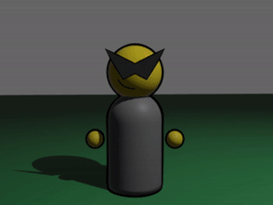

# GRIN
A third person shooter.

## Engine features I'm waiting on
- Dynamic linking on Windows. 0.11 broke it. I dunno what's up with that. Maybe the dependency tree just got huge.
I haven't complained to anybody about it yet. I'll probably get a new computer with linux sometime soon... whatever.
- Extensible `StandardMaterial` (or 3d mesh pipeline in general).
- Ability to disable transform propagation. Propagation is nice but it makes physics tricky.
    - Related... Entity-entity relations (custom hierarchy). Currently using a bootleg ones for rewinds. Not amazing.
- Window icons. Doable already but only through `winit`. This is low priority enough that I can just wait for first-class.

## Platform support
At the moment every single material texture is represented by a texture array.
This most notably excludes [OpenGL ES 2.0 and WebGL 1.0](https://docs.unity3d.com/Manual/class-Texture2DArray.html).
Might fix it later.
